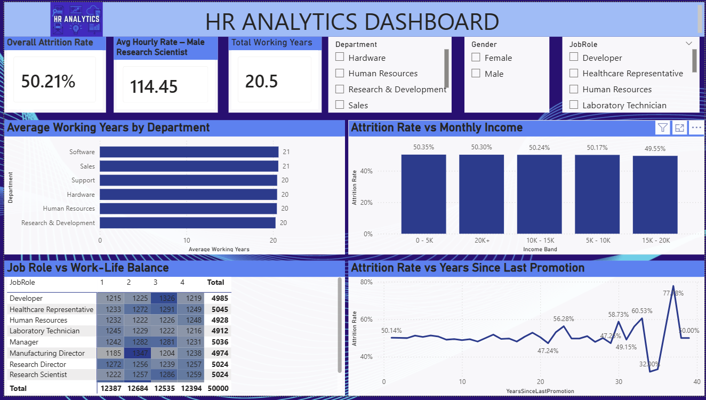
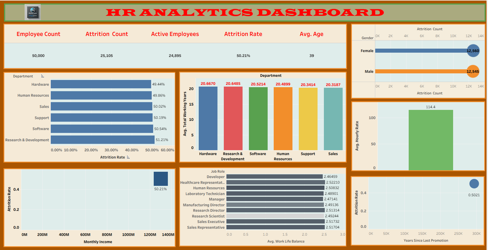
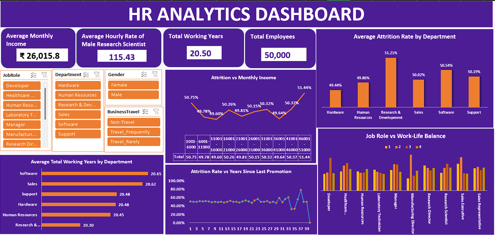

# HR Analytics Project (Power BI, SQL, Excel & Tableau)

## Overview
This HR Analytics project analyzes workforce data to uncover critical turnover drivers and optimize employee retention strategies. By leveraging data from multiple tools, it provides data-driven insights into employee demographics, salary distributions, and attrition trends.

## Dashboards & Previews

### Power BI Dashboard

### Tableau Dashboard

### Excel Dashboard

## Key Insights
- **Uniform Attrition:** Employee turnover remains relatively consistent across all income brackets at around 50%.
- **Highest Turnover:** The **$3K - $6K** monthly income group experiences the highest attrition rate at **51.20%**.
- **Lowest Turnover:** The **$6K - $10K** bracket demonstrates the lowest turnover rate at **49.64%**.
- **High Earners:** Employees earning **$10K+** show a steady turnover rate of **50.20%**.
- **Strategic Takeaway:** Employee retention is influenced by broader workplace factors (job satisfaction, work-life balance) rather than compensation alone.

## Tech Stack & Tools Used
- **Power BI:** DAX calculations, interactive visuals, dynamic measures.
- **Tableau:** Interactive visual charts & dashboards.
- **MySQL:** Querying, filtering, and data aggregation.
- **Excel:** Initial data cleaning, pivot tables, and visualization.
